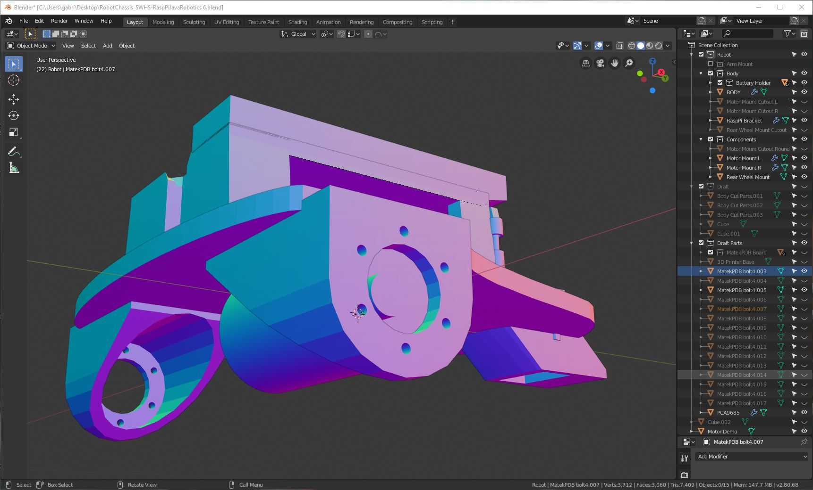

# SWHS-RaspPiJavaRobotics

### Presented by [CSE-SouthwestHS](https://github.com/CSE-SouthwestHS)

To our knowledge, this is the first ever complete, open-source curriculum project addressing both AP CSA (Computer Science Applications) and Robotics.  
**Our Mission** to provide an accessible entry point to Robotics programming for students and instructors of College Level Java.

_Our first beta version driving across campus_|_Robot Chassis Beta 2 Screenshot_
:-----:|:------:
|

**What Makes This Project Unique**
- Completely self contained.  There are no materials, code, products, or research that are not provided or listed in this repository.
- Low cost.  The robotics hardware in the price list can be purchased for approximately $250.
- Ready for use for students and instructors.  All hardware interface programming is already complete with well documented APIs for higher abstraction development.

# HELP REQUEST
This code is (and probably always will be) under development.  It is fully functional but we invite anyone who would like to offer valuable improvements to please join us.  Fork the repository and send us your Pull Requests!
Currently we are working to improve latency between the Front-end GUI, server, and PWM hardward interface.  Please see the issues posted on the
**[HELP REQUEST BRANCH](https://github.com/CSE-SouthwestHS/SWHS-RaspPiJavaRobotics/blob/HelpRequestWebsocket/README.md)**.
Contributors will be recognized and appreciated!!!

# Credits
### The project concept and materials where developed by the following Southwest High School Computer Science students:

>- William @williammunnich - Control System Server Back-end Developer
>- Seay @Cephi495 - Control System GUI and Front end Developer
>- David @dhocken32 - Motor Control Hardware Interface Developer
>- @smue1901 - Robot Hardware Developer & PCA9685 Interface
>- [Aidan Dostal](http://dostal.tech/) @zozo1237 - Project & Quality Assurance Manager
>- Themis @Themis3000 - Web Development / Rasp Pi OS Configuration and Deployment

---

# GETTING STARTED GUIDE
>### - [INSTALLATION](documentation/GETTING_STARTED-INSTALLATION.md)
>### - [RUNNING THE ROBOT](documentation/GETTING_STARTED-RUNNING.md)

---

# Parts List - ([Click to view on Amazon](http://a.co/cpzM4p2))

Item | Price
-----|------:
[Raspberry Pi 4 B 4GB (can be substituted for 1-4 GB or 3 B+ Models)](https://www.amazon.com/Raspberry-Model-2019-Quad-Bluetooth/dp/B07TC2BK1X)|$62.00
[Miuzei Case for Raspberry Pi 4 with Fan, 3A USB-C Power Supply, HDMI Cable](https://www.amazon.com/Miuzei-Raspberry-Cooling-Heat-Sinks-Included/dp/B07VX2WDHM)|$19.99
[Raspberry Pi Camera Module V2-8 Megapixel,1080p](https://www.amazon.com/Raspberry-Pi-Camera-Module-Megapixel/dp/B01ER2SKFS)|$25.00
[Matek V3.1 PDB Power Distribution Board](https://www.amazon.com/Matek-Power-Distribution-Multicopter-Quadcopter/dp/B071CFKFY1)|$10.99
[L298N Motor Drive Controller Board Module Dual H Bridge DC Stepper](https://www.amazon.com/Qunqi-Controller-Module-Stepper-Arduino/dp/B014KMHSW6)|$6.89
[PCA9685 16 Channel 12 Bit PWM Servo Driver](https://www.amazon.com/gp/product/B014KTSMLA)|$9.99
[SunFounder 9g Metal Servo Gear RC Robot SF180M (Digital Semi-Metal Micro Servo Motor) 2pack  2x](https://www.amazon.com/SunFounder-Digital-Helicopter-Fix-Wing-Airplane/dp/B078Y312YP)|$25.98
[Uxcell 12V DC 200RPM Gear Motor Micro Speed Reduction Geared Motor (Choose your Motor Speed)](https://www.amazon.com/uxcell-550RPM-Electric-Reduction-Centric/dp/B01KTXRB90)|15.98
[Pololu 1083 Universal Aluminum MOUNTING HUB for 6mm Shaft Pair](https://www.amazon.com/gp/product/B00B887FX8/ref=ppx_yo_dt_b_asin_title_o03_s01?ie=UTF8&psc=1)|13.89
[BQLZR Black Front Rear Pentagram Plastic Wheel Rims + High Grip Rubber Tires Pack of 4](https://www.amazon.com/BQLZR-Black-Pentagram-Plastic-Rubber/dp/B00ID51M9W)|$14.30
[Bayite 4 Pack 1" Low Profile Casters Wheels](https://www.amazon.com/dp/B071GTK6NZ)|9.99
[Ovonic 11.1V 2200mAh 3S 50C Lipo Battery with Deans Plug](https://www.amazon.com/2200mAh-Airplane-Quadcopter-Helicopter-Multi-Motor/dp/B077P73SDS)|$17.99
[Male T-Plug / T-Connectors Deans Style with 10cm 14awg Wire](https://www.amazon.com/T-Plug-T-Connectors-Deans-Style-BDHI-28/dp/B07MDGT5C1)|$9.98
[C23212 LiPo Voltage Checker + Warning Buzzer ](https://www.amazon.com/RioRand-Hop-ups-C23212-Voltage-Checker/dp/B003Y6E6IE)|$4.99
[iMAX B6 Lipo RC Battery Balance Digital Charger](https://www.amazon.com/Haisito-Charger-Battery-Balance-Discharger/dp/B07QRQT3LC)|$31.99
[Female to Female 4 and 8 Inch Solderless Ribbon Dupont-Compatible Jumper Wires for Breadboard](https://www.amazon.com/GenBasic-Solderless-Dupont-Compatible-Breadboard-Prototyping/dp/B01L5ULRUA)|$5.99
Total|$252.62

- ### [Use the Equipment Auto Calculator at this link to determine the exact list for a specific number of Robots.](https://docs.google.com/spreadsheets/d/1HkJkBlFcnP8gTgiid0Fkntp9MTouEFqrl5WQc5pr8DA/edit?usp=sharing)
*Price list Notes:*

*The items in this list are the best options for each product that we have found to build a single robot.  There are a few items in this list which are packs containing more items than required for just one robot.  Also, if you plan to build multiple robots, in many cases, larger more cost effective packs can be found by searching for products.  This can make the cost of building multiple robots significantly lower.*
